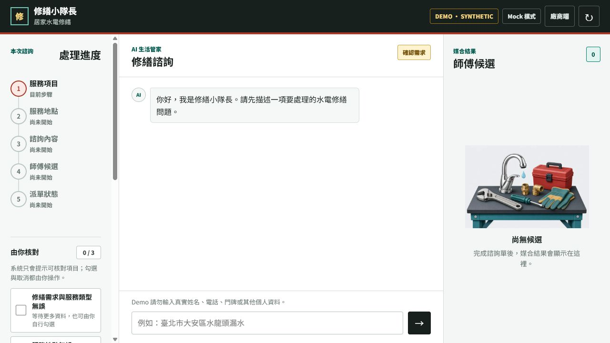
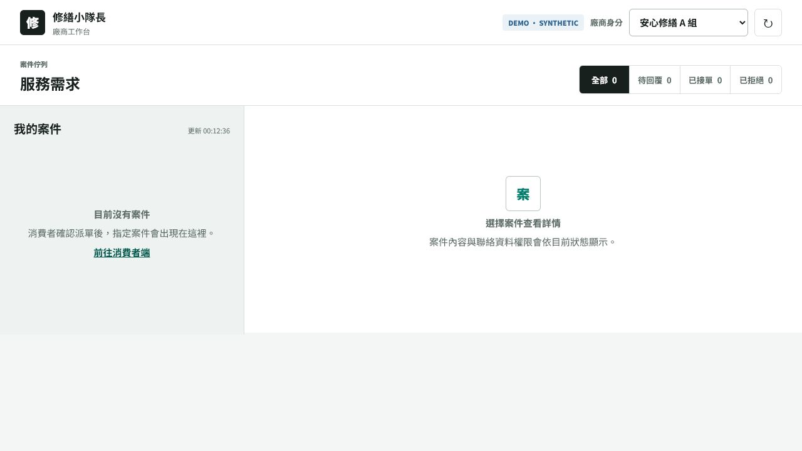
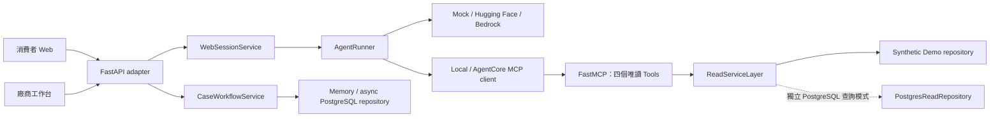

# 修繕小隊長

[](https://github.com/spicyhoney/nw_p/actions/workflows/postgresql-ci.yml)


一個把生成式 AI 放進**可驗證、可人工掌控**流程的居家水電修繕平台。消費者可用
自然語言描述需求，系統會查詢服務、行政區、動態諮詢表單與 synthetic 師傅；只有在
使用者確認分支、Checklist、摘要與派單後，才會建立案件。廠商端則能接受或拒絕指派，
並依狀態查看遮罩或完整的 synthetic 聯絡資料。

本專案源自 2026「雲湧智生：臺灣生成式 AI 應用黑客松」雙人團隊作品，目前由
[@spicyhoney](https://github.com/spicyhoney) 維護為可重現的作品集版本。

<p></p>
<p></p>

## 專案亮點

- **有邊界的 Agent**：模型只決定何時呼叫四個唯讀 MCP Tools，不能執行任意 SQL、
  修改 Checklist、建立案件或直接派單。
- **Human-in-the-loop**：修繕分支、照片建議、資料摘要與派單都有獨立人工確認點；
  舊回應也不能覆蓋較新的 session 狀態。
- **完整雙端流程**：消費者諮詢、媒合與派單，接到廠商工作台的接受／拒絕、聯絡資料
  權限與 Demo 訂單狀態。
- **可替換基礎設施**：Mock、Hugging Face、Amazon Bedrock 共用 `ModelClient`；本機
  FastMCP 與 AgentCore Runtime Remote MCP 共用 `ToolClient` 契約；案件可存於 memory
  或 PostgreSQL。
- **資料品質優先**：官方資料不覆寫；斷裂關聯進 quarantine；人工補充與 synthetic
  資料保留來源標籤，只有通過品質閘門的資料能被 Agent 查詢。
- **可及性基線**：人工 Checklist、鍵盤操作、明顯 focus、`aria-live`、44px 觸控目標、
  reduced motion，以及桌機／手機響應式版面。
- **多模態入口**：選配 HF 圖片分析與台語／國語語音辨識；結果只回填建議或輸入框，
  不會自動送出或繞過人工確認。

## 系統架構



LLM 負責理解與選工具，Service Layer 負責商業規則，Repository 負責資料存取。
FastAPI 與 MCP 都只是 adapter；這個分層讓本機 Mock Demo、PostgreSQL 測試與 AWS
驗證可以共用相同契約，而不把規則散落在 prompt 或前端。

詳細元件、AWS 已驗證證據與未完成邊界見[系統架構](docs/architecture.md)。

## 核心流程

```text
描述一項修繕問題
  -> 確認五種修繕分支之一
  -> Agent 查詢服務、完整行政區與適用表單
  -> 使用者填寫動態表單並核對 Checklist
  -> 確認最新摘要後媒合 synthetic 師傅
  -> 選擇廠商並再次確認派單
  -> 廠商 pending 時只看遮罩聯絡資料
  -> 廠商接受後建立 SYN-ORDER-*，雙端同步狀態
```

危險情境會顯示安全提醒；漏電、觸電、起火、瓦斯或人身危險等訊號會停止一般媒合。
目前產品刻意只聚焦 `service_id=17` 的水電修繕，沒有用大量未完成服務來稀釋流程深度。

## 快速啟動

預設 Mock 模式不需要 token、AWS 或 PostgreSQL。

```powershell
git clone https://github.com/spicyhoney/nw_p.git
cd nw_p
py -3.12 -m venv .venv
.\.venv\Scripts\Activate.ps1
python -m pip install -e ".[app,data,dev]"
home-repair-web
```

macOS／Linux 將建立與啟用虛擬環境的兩行改為：

```bash
python3 -m venv .venv
source .venv/bin/activate
```

啟動後開啟：

- 消費者端：`http://127.0.0.1:8080/`
- 廠商端：`http://127.0.0.1:8080/provider`

終端版 Agent smoke test：

```powershell
home-repair-agent-demo --scripted
```

## Adapter 設定

| 目的 | 環境變數 | 可用值／說明 |
|---|---|---|
| 對話模型 | `WEB_MODEL_PROVIDER` | `mock`、`huggingface`、`bedrock` |
| 唯讀工具位置 | `TOOL_TRANSPORT` | `local`、`agentcore_remote_mcp` |
| 案件儲存 | `WEB_CASE_REPOSITORY` | `memory`、`postgres` |
| 圖片分析 | `WEB_MEDIA_PROVIDER` | 預設停用；HF 模式需明確同意與 `HF_TOKEN` |
| 語音辨識 | `HF_ASR_*` | 選配的台語／國語 ASR endpoint |

完整設定範例在 [`.env.example`](.env.example)。所有 hosted provider 都是 fail-closed：
缺少 token、AWS credential、Runtime ARN 或連線失敗時會停止並回報，不會靜默切回
Mock 造成假成功。

## 驗證

作品集整理基線於 2026-08-02 在 Python 3.12 執行：

```text
327 passed, 17 skipped, 168 subtests passed
Ruff check: passed
Ruff format --check: passed
JavaScript syntax and regression scripts: passed
```

17 個 skip 是未提供測試 PostgreSQL 或外部 live provider 時的條件式測試，不列入成功
證據。GitHub Actions 會啟動 PostgreSQL 16 service、檢查完整 Python tree、JavaScript，
並執行完整 pytest。

本機驗證指令：

```powershell
python -m pytest -q
python -m ruff check .
python -m ruff format --check .
node --check src/home_repair_agent/web/static/app.js
node --check src/home_repair_agent/web/static/provider.js
node tests/test_checklist_concurrency.js
node tests/test_media_stale_refresh.js
```

## 資料與安全邊界

- 官方原始資料不在本 repo 重新散布；pipeline 只寫入 `data/processed/` 與報告。
- 不明 `service_id`、孤兒關聯、格式錯誤與疑似個資不會被猜測補值，而是隔離或遮罩。
- Demo 師傅、聯絡資料、案件、訂單與時段全部標示為 `synthetic`。
- 四個 MCP Tools 僅能查服務、行政區、諮詢表單與媒合候選。
- 寫入只能經受控 Web API、確認、冪等鍵、交易與 audit；模型沒有資料庫權限。
- `.env`、token、AWS key、Runtime ARN、真實個資與原始圖片不得提交。

詳細規則見[資料政策](docs/data-policy.md)與[資料字典](docs/data-dictionary.md)。

## 目前限制

- Demo 身分下拉選單不是正式登入或 RBAC。
- 沒有真實廠商、付款、通知或保證時段；媒合結果不構成正式預約。
- Web conversation／Checklist 仍是 process-local；案件 workflow 才能切 PostgreSQL。
- Repo 不維護公開網站或長期 AgentCore endpoint；AWS 文件記錄的是比賽期間的遮罩
  live evidence，不代表資源目前仍存在。
- Hugging Face、Bedrock、AgentCore 與語音服務需要各自帳號、權限、網路與可能的額度。

## 導覽

- [白話專案指南](docs/project-guide.md)
- [實作索引與驗證證據](docs/implementation-index.md)
- [Web 與 API 契約](src/home_repair_agent/web/README.md)
- [Agent 與 provider adapters](src/home_repair_agent/agent/README.md)
- [MCP Server 契約](src/home_repair_agent/mcp_server/README.md)
- [資料清洗操作手冊](docs/data-cleaning-runbook.md)
- [目前待辦](TASKS.md)

完整 commit 與 PR 歷史保留兩人團隊的共同開發紀錄；目前公開版本的文件、測試與
release 整理由 `spicyhoney` 維護。
