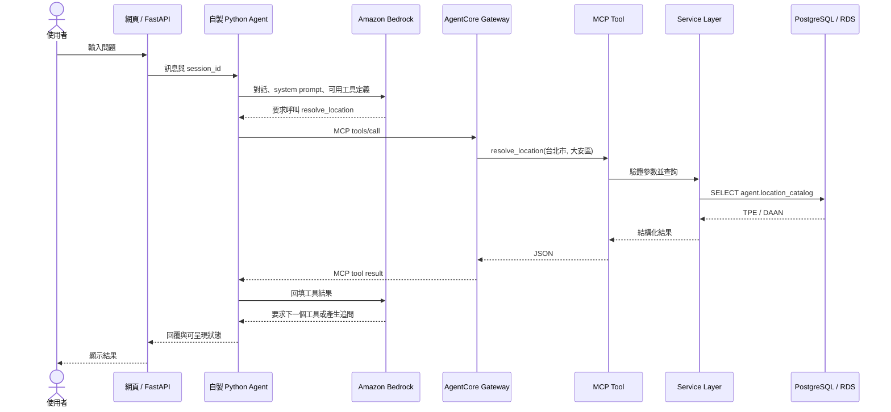
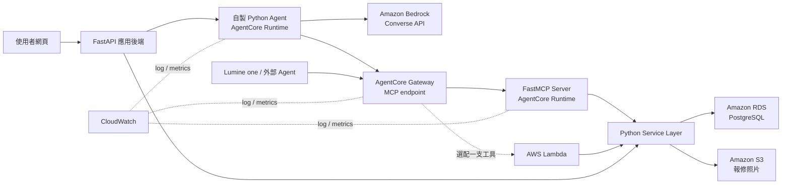

# 系統與 AWS 架構

## 先說結論

AWS 不是拿來「訓練我們自己的模型」，也不是讓 Agent 直接連資料庫。這個專案中：

- Python data pipeline：整理主辦方資料並保留來源與品質標記。
- PostgreSQL：保存清洗後的服務、行政區、表單、案件、媒合與訂單。
- Service Layer：實作查詢、驗證、媒合、建案與建單等商業規則。
- MCP Tools：把 Service Layer 包成 Agent 能安全呼叫的有限工具。
- Amazon Bedrock：理解使用者語句、決定何時呼叫哪個工具、整理回覆。
- Amazon Bedrock AgentCore：在 AWS 上執行 Agent，並以 Gateway 管理 MCP 工具的
  發現、路由、驗證與權限。

所以最重要的邊界是：

> LLM 負責理解與決策；Tool 與 Service Layer 負責執行；PostgreSQL 負責保存事實。

## 目前完成到哪裡

| 層級 | 目前狀態 | 下一步 |
|---|---|---|
| 資料清洗 | 已完成 B+ pipeline 與品質報告 | 持續補測試資料 |
| PostgreSQL | 已在真實 PostgreSQL 16.14 通過 loader、讀取與案件 workflow transaction 測試 | 實作最小權限與正式 RDS 連線 |
| Service Layer | 已完成唯讀查詢／媒合、派單／接單與 memory／PostgreSQL repository | 正式登入、時段保留與排程衝突 |
| MCP Tools | 已完成四個唯讀 Tool 與記憶體內 protocol tests；寫入仍未公開 | 先做真實模型 eval；外部 Agent 確有需求時才加受限寫入 Tool |
| Agent | 已完成核心迴圈、MCP Client 與 Mock 多輪測試 | 實作 BedrockModelClient 與 tool-selection eval |
| AWS | 尚未串接，且目前沒有比賽憑證 | 拿到帳號、Region 與額度後才做雲端整合 |
| Web / FastAPI | 已完成本機雙端 P1 與可選 PostgreSQL 案件持久化 | 消費者無障礙體驗、正式登入、固定模型 eval、公開部署 |

目前派單 workflow 與 Web 無資料庫聚焦測試為 `33 passed, 5 skipped`；完整測試結果以
[實作索引](implementation-index.md)的最近驗證為準。這些測試已驗證資料清洗、
Service Layer、MCP 協定、Mock/HF adapter contract，以及本機雙端 Web 流程；
仍不代表正式身分驗證、Bedrock、語音或 AWS 部署已
端到端完成。

## 一句話如何變成資料庫查詢

以「台北市大安區水龍頭漏水，週六下午可以來嗎？」為例：



完整流程如下：

1. FastAPI 收到文字，但不自行猜服務或直接拼 SQL。
2. 自製 Python Agent 把對話、工具規格與規則送給 Bedrock Converse API。
3. Bedrock 回傳一般文字，或結構化的 `toolUse` 請求。
4. Agent 透過 MCP 呼叫 AgentCore Gateway。
5. Gateway 只允許白名單內的工具，並把請求路由到 FastMCP Server 或指定 Lambda。
6. Tool 用 Pydantic 驗證參數，再呼叫共用的 Service Layer。
7. 只讀 Service 只能查 `agent.*` views；寫入 Service 只允許預先定義的 repository
   指令與目標表，不能讓 LLM 執行任意 SQL。
8. 查詢結果沿原路回到 Bedrock，由模型轉成自然語言。
9. 建立案件、確認預約、建立訂單等寫入操作，必須先取得使用者明確確認。
10. 寫入操作由 Service Layer 在交易中完成，模型不能直接修改資料庫。

這就是「自動查詢」的來源：Agent 決定要呼叫工具，但真正查詢的是我們寫好的
Tool、Service Layer 與 SQL。

## 聊天與按鈕是兩個入口

| 使用方式 | 呼叫路徑 | 是否需要 LLM |
|---|---|---|
| 「我家水龍頭漏水」 | FastAPI -> Agent -> Bedrock -> MCP Tool -> Service Layer -> DB | 需要 |
| 點「查詢訂單」 | FastAPI -> Service Layer -> DB | 不需要 |
| 點「確認預約」 | FastAPI -> Service Layer -> DB | 不需要，但需確認與權限檢查 |
| Lumine one 等外部 Agent | 外部 Agent -> MCP Gateway -> Tool -> Service Layer -> DB | 使用外部 Agent 自己的模型 |

兩條路共用同一套 Service Layer，所以相同輸入必須得到相同的商業結果。FastAPI
是網頁後端，不是前端；MCP 是 Agent 的工具協定，也不是資料庫驅動程式。

目前本機派單 P0 採用按鈕入口：

```text
消費者／廠商按鈕
  -> FastAPI
  -> CaseWorkflowService
  -> memory 或 PostgreSQL CaseWorkflowRepository
```

這條路已驗證確認、冪等、指派廠商隔離、audit、原子狀態轉換與 PostgreSQL
持久化，但沒有寫入 MCP Tool。正式版會把連線切到 RDS 並替換身分 adapter，
不把規則搬進 route、LLM 或前端。完整契約見[派單／接單 P0](provider-workflow.md)。

## AWS 服務各自用在哪裡

| AWS 服務 | 在本專案的工作 | 優先度 |
|---|---|---|
| Amazon Bedrock | 對話理解、欄位抽取、選擇工具、案件摘要；不負責 SQL 與資料寫入 | P0，拿到憑證後先接 |
| AgentCore Gateway | 對外提供統一 MCP endpoint，讓自家 Agent 或 Lumine one 能列出並呼叫白名單工具 | P1，對齊工作坊 |
| AgentCore Runtime | 託管自製 Agent 或 FastMCP Server；本機階段不需要 | P1，拿到環境後部署 |
| Amazon RDS for PostgreSQL | 正式環境的 PostgreSQL；本機仍用同版 PostgreSQL 開發 | P1，部署時再換連線字串 |
| Amazon S3 | 私有保存報修照片；資料庫只存 object key，前端用短效 presigned URL 上傳或查看 | P1，有照片功能才接 |
| IAM | 讓 Runtime、Gateway、Lambda、S3、RDS 之間以最小權限存取 | P0，部署時必做 |
| CloudWatch | 收集 Runtime、Gateway、Lambda 的 log、延遲與錯誤，供除錯與展示可稽核性 | P1，雲端整合時使用 |
| AWS Lambda | 可把單一、無狀態工具做成 Gateway target；不是 MVP 必要條件 | P2，有餘裕再做一支 |
| Amazon API Gateway | 給一般 HTTP client 公開 REST API；AgentCore Gateway 已處理 MCP，因此不應為了名詞重複架設 | P2，確有外部 REST 需求才用 |

### AgentCore Gateway 和 API Gateway 的差別

- AgentCore Gateway 面向 Agent，主要處理 MCP `tools/list`、`tools/call`、工具路由與
  身分驗證。
- API Gateway 面向一般網頁、手機或合作廠商的 HTTP API。
- 我們的 Agent 呼叫工具優先走 AgentCore Gateway。
- 網頁按鈕先走 FastAPI；只有部署方式需要公開 Lambda REST endpoint 時，才加
  API Gateway。

### 工作坊畫面對應到我們的專案

工作坊的例子是：

```text
Agent -> AgentCore Gateway -> check_warranty Lambda
```

換成我們的題目，可以是：

```text
Agent -> AgentCore Gateway -> match_service_providers MCP Tool
                           -> get_order_status MCP Tool
```

Gateway 能把 Lambda、API Gateway REST API、OpenAPI service 或既有 MCP Server
統一呈現為 MCP 工具。我們先做 FastMCP Server，若時間足夠，再挑一個無狀態工具
改成 Lambda target 展示。不要同時為同一個工具維護兩套商業邏輯。

## 建議的 AWS 目標架構



FastAPI 最終放在主辦方指定環境或可執行 Python Web service 的部署環境；在規格
尚未公布前，不先綁死在某個 AWS Web hosting 服務。

## 沒有 AWS 憑證時怎麼開發

沒有 AWS 金鑰不會擋住目前工作。先固定四個介面：

| 介面 | 本機實作 | AWS 實作 |
|---|---|---|
| `ModelClient` | `MockModelClient`，回固定 tool call | `BedrockModelClient` |
| `ToolClient` | 直接呼叫本機 FastMCP / Python tool | `AgentCoreGatewayToolClient` |
| `Repository` | 本機 PostgreSQL | RDS PostgreSQL |
| `ObjectStorage` | 本機測試圖片或假 object key | S3 presigned URL |

本機開發設定：

```dotenv
APP_ENV=local
MODEL_PROVIDER=mock
TOOL_TRANSPORT=local
OBJECT_STORAGE=local
```

拿到比賽環境後，只切換 adapter：

```dotenv
APP_ENV=competition
MODEL_PROVIDER=bedrock
TOOL_TRANSPORT=agentcore_gateway
OBJECT_STORAGE=s3
```

程式不得保存 `AWS_ACCESS_KEY_ID` 或 `AWS_SECRET_ACCESS_KEY`。開發者登入優先使用
主辦方提供的暫時憑證或 AWS IAM Identity Center；部署在 AWS 上的程式使用 IAM
role。AWS SDK 會從標準 credential provider chain 取得身分，不需要把金鑰寫進
程式或提交到 GitHub。

## 實作順序

1. 已完成 Service Layer 的 `search_services`、`resolve_location`、
   `get_consultation_form`，並通過真實 PostgreSQL 測試。
2. 已把同一批函式包成 FastMCP Tools，並通過本機 MCP client protocol tests。
3. 已用 Mock Model 跑完「輸入 -> tool call -> tool result -> 回覆」迴圈。
4. 拿到 AWS 憑證後實作 `BedrockModelClient`，不改迴圈、工具與資料庫邏輯。
5. 已完成派單／接單 P0：確認、冪等、授權、audit 與狀態轉換。
6. 已新增 PostgreSQL transaction repository；取得 AWS 環境後切到 RDS 連線。
7. 加入正式登入與 RBAC。
8. 部署 Agent / MCP Server 到 AgentCore Runtime，接上 Gateway。
9. 有照片需求再接 S3；有餘裕才把一支工具改成 Lambda target。
10. 最後才評估是否真的需要 API Gateway。

## 安全與資料邊界

- 原始資料保持唯讀，無法確認的資料留在 `quarantine`。
- Agent 不取得資料庫帳密；只讀 Tool 只查 `agent.*` views，不讀 raw、staging 或
  quarantine。
- 寫入 Tool 只能經 Service Layer、專用資料庫角色與白名單 repository 操作正式
  業務表。
- `agent_eligible=false` 的服務與未解 mapping 不得出現在推薦結果。
- 建案、預約與訂單屬於副作用操作，必須有確認、交易與 audit log。
- LLM 不接觸完整個資；Tool 回傳遮罩資料，敏感欄位在正式環境加密保存。
- 合成服務商、時段、案件與訂單必須保留 `source_type=synthetic`。

## 官方參考

- [Amazon Bedrock Converse API](https://docs.aws.amazon.com/bedrock/latest/userguide/conversation-inference.html)
- [AgentCore Runtime](https://docs.aws.amazon.com/bedrock-agentcore/latest/devguide/agents-tools-runtime.html)
- [AgentCore Gateway 使用方式](https://docs.aws.amazon.com/bedrock-agentcore/latest/devguide/gateway-using.html)
- [AgentCore Gateway target 類型](https://docs.aws.amazon.com/bedrock-agentcore/latest/devguide/gateway-core-concepts.html)
- [IAM 安全最佳實務](https://docs.aws.amazon.com/IAM/latest/UserGuide/best-practices.html)
- [S3 presigned URL 上傳](https://docs.aws.amazon.com/AmazonS3/latest/userguide/PresignedUrlUploadObject.html)
