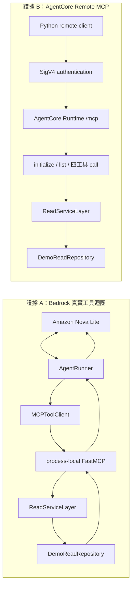
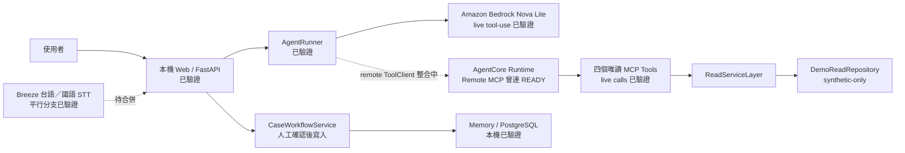
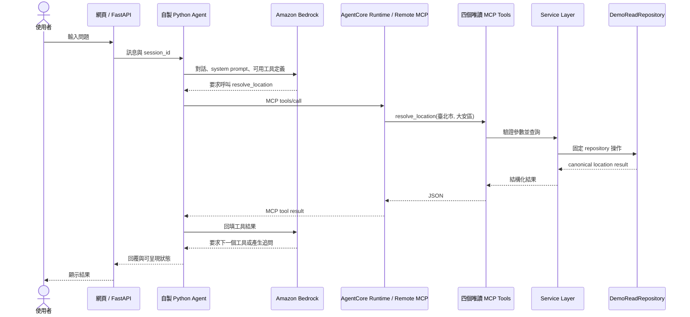
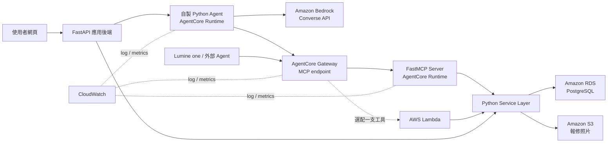

# 系統與 AWS 架構

第一次閱讀本專案時，先看[專案白話指南](project-guide.md)；本頁把「已合併基線」、
「2026-08-02 已取得的 AWS live 證據」、「最後 Demo 組裝」與「未來 production
架構」分開說明。未完成工作以 [TASKS](../TASKS.md) 為準。

## 先說結論

AWS 不是拿來「訓練我們自己的模型」，也不是讓 Agent 直接連資料庫。這個專案中：

- Python data pipeline：整理主辦方資料並保留來源與品質標記。
- PostgreSQL：保存清洗後的服務、行政區、表單、案件、媒合與訂單。
- Service Layer：實作查詢、驗證、媒合、建案與建單等商業規則。
- MCP Tools：把 Service Layer 包成 Agent 能安全呼叫的有限工具。
- Amazon Bedrock：理解使用者語句、決定何時呼叫哪個工具、整理回覆。
- Amazon Bedrock AgentCore Runtime：在 AWS 上託管 Remote MCP Server，讓本機
  Agent 以標準 MCP `initialize`、`tools/list`、`tools/call` 呼叫四個唯讀工具。
- AgentCore Gateway：未來若要把多個 target 統一成對外 MCP 入口再評估；目前 Demo
  沒有使用 Gateway，不能把 Runtime 說成 Gateway。

所以最重要的邊界是：

> LLM 負責理解與決策；Tool 與 Service Layer 負責執行；PostgreSQL 負責保存事實。

## 目前完成到哪裡

| 層級 | 目前狀態 | 下一步 |
|---|---|---|
| 資料清洗 | 已完成 B+ pipeline 與品質報告 | 持續保留 provenance 與 synthetic 標示 |
| PostgreSQL | 已在 PostgreSQL 16.14 通過 loader、讀取與 async 案件 workflow transaction 測試 | RDS 不在目前 AWS Demo 路徑 |
| Service Layer | 已完成唯讀查詢／媒合、派單／接單與 memory／async PostgreSQL repository | 正式登入、時段保留與排程衝突 |
| MCP Tools | 四個唯讀 Tool 已通過本機 protocol、Bedrock process-local E2E 與 AgentCore Remote MCP live 驗證 | 寫入仍由受控 Web API 執行，不公開成 MCP Tool |
| Agent / Model | AgentRunner、Mock、HF 與 Bedrock adapter contract 已完成；Nova Lite 四工具 live 閉環通過 | 固定最終 Demo provider 與失敗處理 |
| AgentCore Runtime | `us-west-2` 的 synthetic-only Remote MCP 曾達 `READY`；`initialize`、`tools/list`、四工具與 ID provenance 均通過 | 保存遮罩 evidence、整合 Web ToolClient、Demo 後 cleanup |
| Web / FastAPI | 已完成本機雙端流程、人工 Checklist、圖片流程、無障礙基線與可選 PostgreSQL 案件持久化 | 整合 remote ToolClient 與平行語音／圖片修正分支 |
| 台語／國語語音 | 平行分支已驗證 Breeze ASR 回填繁中輸入框；公開 HF Space 約 45–60 秒且無 SLA | 合併與現場 smoke；TTS 不列為已完成 |
| 未做的雲端項目 | 無 AgentCore Gateway、RDS、公開 AWS 網站、正式 auth／RBAC | 只列未來 production，不冒充本次證據 |

完整測試批次、commit 與 focused evidence 以[實作索引](implementation-index.md)為準。
目前最重要的邊界是：Bedrock live 閉環和 AgentCore Remote MCP live 閉環都已個別
通過，但 Web 使用 remote ToolClient 的最後組裝仍在進行。這些證據也不代表公開 AWS
網站、RDS、正式身分驗證或 production 台語語音已完成。

## 兩條已完成的 AWS live 證據

目前先完成的是兩條彼此獨立的閉環；它們證明模型端與 Remote MCP 端各自可用：



證據 A 沒有跨網路呼叫 AgentCore；證據 B 沒有經過 Web 或 Bedrock。把兩條路接起來，
才是最後 browser-to-AWS Demo。

## 已驗證元件與最後 Demo 組裝



圖中的兩條虛線就是最後整合工作；其他實線只表示該元件或子路徑有驗證證據，不表示
整張圖已經做過一次完整 browser-to-AWS E2E。

## 預定最終 Demo 路徑（待 browser-to-AWS E2E）

以「台北市大安區水龍頭漏水，週六下午可以來嗎？」為例：

> 以下是整合目標，不是目前完成證據；只有最終 remote ToolClient 組裝與驗收通過後，
> 才能把這張 sequence 當成實際 E2E。



完整流程如下：

1. FastAPI 收到文字，但不自行猜服務或直接拼 SQL。
2. 自製 Python Agent 把對話、工具規格與規則送給 Bedrock Converse API。
3. Bedrock 回傳一般文字，或結構化的 `toolUse` 請求。
4. Agent 透過 remote ToolClient，以 SigV4 身分呼叫 AgentCore Runtime 的 MCP endpoint。
5. Runtime 只暴露既有四個唯讀 FastMCP Tools；目前沒有 Gateway 或 Lambda target。
6. Tool 用 Pydantic 驗證參數，再呼叫共用的 Service Layer。
7. 目前 AgentCore Demo 使用 `DemoReadRepository` 的 synthetic seed；本機獨立 MCP
   Server 另有 `PostgresReadRepository` 整合測試。兩者都不能讓 LLM 執行任意 SQL。
8. 查詢結果沿原路回到 Bedrock，由模型轉成自然語言。
9. 建立案件、確認預約、建立訂單等寫入操作，必須先取得使用者明確確認。
10. 寫入操作由 Service Layer 在交易中完成，模型不能直接修改資料庫。

這就是「自動查詢」的來源：Agent 決定要呼叫工具，但真正查詢的是我們寫好的
Tool、Service Layer 與 SQL。

## 聊天與按鈕是兩個入口

| 使用方式 | 呼叫路徑 | 是否需要 LLM |
|---|---|---|
| 「我家水龍頭漏水」 | FastAPI -> Agent -> Bedrock -> MCP Tool -> Service Layer -> Repository | 需要 |
| 點「查詢訂單」 | FastAPI -> Service Layer -> Repository | 不需要 |
| 點「確認預約」 | FastAPI -> Service Layer -> Repository | 不需要，但需確認與權限檢查 |
| 未來外部 Agent | 外部 Agent -> 經核准的 MCP auth／Gateway -> Tool -> Service Layer | 目前未做，不列為 Demo 完成 |

兩條路共用同一套 Service Layer，所以相同輸入必須得到相同的商業結果。FastAPI
是網頁後端，不是前端；MCP 是 Agent 的工具協定，也不是資料庫驅動程式。

目前本機派單 P0 採用按鈕入口：

```text
消費者／廠商按鈕
  -> FastAPI
  -> CaseWorkflowService
  -> memory 或 PostgreSQL CaseWorkflowRepository
```

這條路已驗證確認、冪等、指派廠商隔離、audit、原子狀態轉換與 PostgreSQL
持久化，但沒有寫入 MCP Tool。正式版會把連線切到 RDS 並替換身分 adapter，
不把規則搬進 route、LLM 或前端。完整契約見[派單／接單 P0](provider-workflow.md)。

## AWS 服務各自用在哪裡

| AWS 服務 | 在本專案的工作 | 目前證據／狀態 |
|---|---|---|
| Amazon Bedrock | 對話理解、欄位抽取、選擇工具與整理回覆；不負責 SQL 與資料寫入 | Nova Lite Converse 與四工具 live E2E 已通過 |
| AgentCore Runtime | 託管 synthetic-only FastMCP Server | Remote MCP 曾達 READY；initialize/list/call 已通過 |
| IAM / workload identity | Runtime execution 與呼叫端 SigV4 身分 | Demo 部署已使用；證據須遮罩 account／ARN |
| Amazon S3 | 保存 AgentCore direct-code deployment artifact | Demo 部署已使用私有 bucket；不是報修照片 storage 的完成證據 |
| CloudWatch Logs | Runtime log group 與除錯 | Demo 部署已建立；不得記錄 credential、完整 payload 或個資 |
| AgentCore Gateway | 未來統一多 target MCP endpoint | 本次未建立、未使用 |
| Amazon RDS for PostgreSQL | 未來正式環境資料庫 | 本次未建立；目前 remote MCP 用 synthetic Demo repository |
| AWS Web hosting / API Gateway | 未來公開 Web 或一般 REST API | 本次未建立；目前網頁跑在本機 |

### Runtime、AgentCore Gateway 和 API Gateway 的差別

- AgentCore Runtime 可以直接執行一個 MCP Server；這是目前 live Demo 已採用的方式。
- AgentCore Gateway 面向 Agent，適合把多個 MCP／Lambda／API target 統一成工具入口；
  本次 Demo 沒有使用。
- API Gateway 面向一般網頁、手機或合作廠商的 HTTP API。
- 我們的目前 AgentCore Demo 直接呼叫 Runtime；未來確有多 target 需求才加 Gateway。
- 網頁按鈕先走 FastAPI；只有部署方式需要公開 Lambda REST endpoint 時，才加
  API Gateway。

### 工作坊 Gateway 畫面如何對應到黑客松後擴充

工作坊的例子是：

```text
Agent -> AgentCore Gateway -> check_warranty Lambda
```

若黑客松後確定需要多 target Gateway，概念上可以是：

```text
Agent -> AgentCore Gateway -> match_service_providers MCP Tool
                           -> 另一個未來核准的唯讀 Tool
```

Gateway 能把 Lambda、API Gateway REST API、OpenAPI service 或既有 MCP Server
統一呈現為 MCP 工具。本次 feature freeze 不新增 Gateway 或 Lambda target；未來若要
擴充，也不能同時為同一個工具維護兩套商業邏輯。

## 未來 production 目標架構（非本次完成證據）



FastAPI 未來可放在主辦方指定環境或可執行 Python Web service 的部署環境；目前沒有
公開 AWS 網站。上圖中的 Gateway、RDS、正式 S3 圖片儲存與完整 CloudWatch 維運都屬
production 方向，不應放進本次 Demo 的「已完成」清單。

## Adapter 切換與 credential 邊界

沒有 AWS 金鑰不會擋住目前工作。先固定四個介面：

| 介面 | 本機實作 | AWS／production adapter |
|---|---|---|
| `ModelClient` | `MockModelClient`，回固定 tool call | `BedrockModelClient` |
| `ToolClient` | 直接呼叫本機 FastMCP / Python tool | AgentCore Runtime remote ToolClient（整合中） |
| `Repository` | 本機 PostgreSQL | RDS PostgreSQL |
| `ObjectStorage` | 本機測試圖片或假 object key | S3 presigned URL |

本機開發設定：

```dotenv
APP_ENV=local
MODEL_PROVIDER=mock
TOOL_TRANSPORT=local
OBJECT_STORAGE=local
```

最終 Demo 的概念設定如下；實際環境變數名稱以整合後的 Web README 為準：

```dotenv
APP_ENV=competition
MODEL_PROVIDER=bedrock
TOOL_TRANSPORT=agentcore_runtime
OBJECT_STORAGE=local
```

程式不得保存 `AWS_ACCESS_KEY_ID` 或 `AWS_SECRET_ACCESS_KEY`。開發者登入優先使用
主辦方提供的暫時憑證或 AWS IAM Identity Center；部署在 AWS 上的程式使用 IAM
role。AWS SDK 會從標準 credential provider chain 取得身分，不需要把金鑰寫進
程式或提交到 GitHub。

## 實作順序

1. 已完成 Service Layer 的 `search_services`、`resolve_location`、
   `get_consultation_form`，並通過真實 PostgreSQL 測試。
2. 已把同一批函式包成 FastMCP Tools，並通過本機 MCP client protocol tests。
3. 已用 Mock Model 跑完「輸入 -> tool call -> tool result -> 回覆」迴圈。
4. 已實作 `BedrockModelClient`，並以 Nova Lite 通過 process-local MCP 四工具 live E2E。
5. 已完成派單／接單 P0：確認、冪等、授權、audit 與狀態轉換。
6. 已新增 PostgreSQL transaction repository；RDS 留作 production 方向。
7. 已將 synthetic-only Remote MCP 部署到 AgentCore Runtime，並完成四工具 live 驗證。
8. 目前整合 Web remote ToolClient，完成 browser → Bedrock → AgentCore 的最終 Demo E2E。
9. Demo 結束後執行 cleanup，避免持續計費；保留遮罩後 evidence。
10. 正式登入、RBAC、Gateway、RDS、正式 S3 圖片儲存與 API Gateway 留待後續。

## 安全與資料邊界

- 原始資料保持唯讀，無法確認的資料留在 `quarantine`。
- Agent 不取得資料庫帳密；只讀 Tool 只查 `agent.*` views，不讀 raw、staging 或
  quarantine。
- 寫入 Tool 只能經 Service Layer、專用資料庫角色與白名單 repository 操作正式
  業務表。
- `agent_eligible=false` 的服務與未解 mapping 不得出現在推薦結果。
- 建案、預約與訂單屬於副作用操作，必須有確認、交易與 audit log。
- LLM 不接觸完整個資；Tool 回傳遮罩資料，敏感欄位在正式環境加密保存。
- 合成服務商、時段、案件與訂單必須保留 `source_type=synthetic`。

## 官方參考

- [Amazon Bedrock Converse API](https://docs.aws.amazon.com/bedrock/latest/userguide/conversation-inference.html)
- [AgentCore Runtime](https://docs.aws.amazon.com/bedrock-agentcore/latest/devguide/agents-tools-runtime.html)
- [AgentCore Gateway 使用方式](https://docs.aws.amazon.com/bedrock-agentcore/latest/devguide/gateway-using.html)
- [AgentCore Gateway target 類型](https://docs.aws.amazon.com/bedrock-agentcore/latest/devguide/gateway-core-concepts.html)
- [IAM 安全最佳實務](https://docs.aws.amazon.com/IAM/latest/UserGuide/best-practices.html)
- [S3 presigned URL 上傳](https://docs.aws.amazon.com/AmazonS3/latest/userguide/PresignedUrlUploadObject.html)
