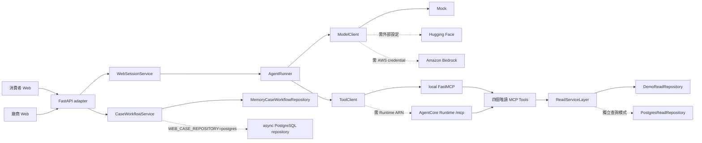
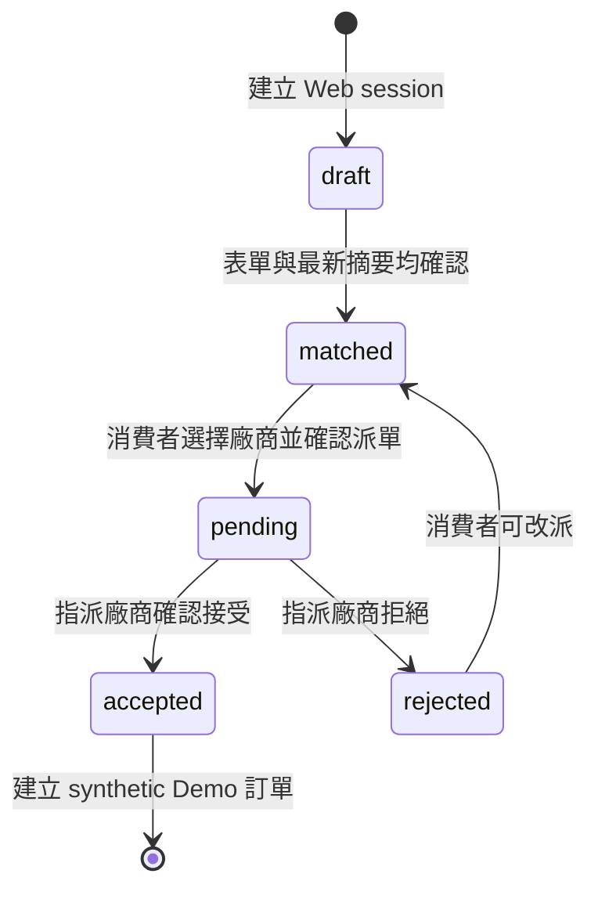
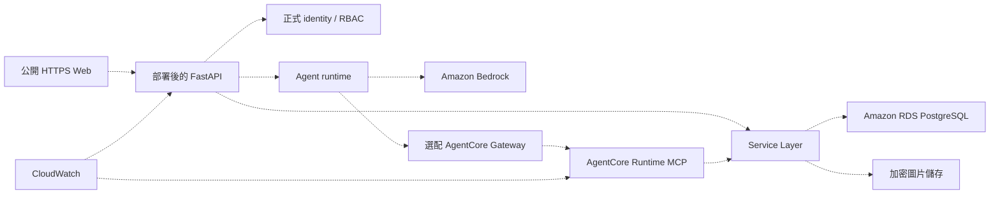

# 系統與 AWS 架構

最後更新：2026-08-02

本頁區分三件事：現在任何人可重現的本機系統、比賽期間完成的 AWS live 證據，以及
尚未實作的 production 元件。第一次閱讀可先看[專案白話指南](project-guide.md)。

## 核心原則

> LLM 負責理解與選工具；Service Layer 負責商業規則；Repository 負責保存事實。

- FastAPI 是消費者與廠商 Web 的 adapter，不是規則所在。
- MCP 是 Agent 呼叫有限工具的協定，不是資料庫 driver。
- Agent 看不到資料庫密碼，也不能送任意 SQL。
- 建案、派單與接案有副作用，必須走人工確認、冪等、交易與 audit。

## 目前可重現架構



實線是預設 Mock Demo 能直接執行的路徑；虛線 adapter 需要額外服務或 credential。
`WEB_CASE_REPOSITORY=postgres` 只切換案件／訂單／audit 寫入，不會偷偷把唯讀
`DemoReadRepository` 換成 PostgreSQL。

## 兩條使用者入口

| 入口 | 路徑 | LLM 是否參與 |
|---|---|---|
| 輸入「臺北市大安區水龍頭漏水」 | Web -> Agent -> Model -> MCP -> Service -> Repository | 是，負責理解與選工具 |
| 點擊確認摘要、派單或接案 | Web -> FastAPI -> CaseWorkflowService -> Repository | 否，直接執行受控規則 |

聊天與按鈕共用 Service 契約。模型可以提出建議，但不能模擬使用者按下確認。

## 四個唯讀 MCP Tools

| Tool | 目的 | 主要輸出 |
|---|---|---|
| `search_services` | 尋找可供 Agent 使用的服務 | canonical `service_id`、名稱、來源 |
| `resolve_location` | 解析完整縣市／行政區 | canonical `location_id`、名稱 |
| `get_consultation_form` | 取得服務適用的最新表單 | form key、version、topics |
| `match_service_providers` | 依服務、地點、表單與時段媒合 | synthetic 候選、時段、分數、來源 |

後一個工具需要的 ID 必須來自前一個成功 ToolResult，不能由模型猜。工具先以 Pydantic
驗證輸入，再呼叫 `ReadServiceLayer`；Tool 不自行拼 SQL。

## 寫入狀態機



- `pending` 只回傳遮罩 contact。
- `accepted` 才揭露完整 synthetic contact 並建立 `SYN-ORDER-*`。
- repository 交易同時保存 case、order、idempotency 與 audit。
- 非指派廠商無法讀取或變更案件；廠商下拉選單只是 Demo 身分，不是正式 auth。

## 資料層

```text
官方原始檔（唯讀、本 repo 不重新散布）
  -> Python B+ pipeline
  -> official / external_reference / manual_configuration / synthetic 標籤
  -> verified core data + quarantine + quality report
  -> PostgreSQL core / workflow schemas
  -> agent.* read-only views
```

未知代碼與斷裂關聯不補猜；疑似個資不進 Agent view。AgentCore Demo 使用
`DemoReadRepository` 的 synthetic seed，而不是冒充已部署 RDS。

## AWS live 證據

比賽期間曾驗證：

```text
Browser -> FastAPI -> AgentRunner -> Amazon Nova Lite
  -> SigV4 AgentCoreMCPToolClient
  -> AgentCore Runtime /mcp
  -> initialize + tools/list + 四個 tools/call
  -> ReadServiceLayer -> DemoReadRepository
```

- Region：`us-west-2`。
- 跑通 service 17、臺北市大安區、`repair_form_v1` 與兩位 synthetic 候選。
- Runtime ID、ARN、account、credential、完整 provider payload 與 endpoint 均未提交。
- 遮罩 evidence 在 `reports/agentcore_remote_mcp_demo.json`，設計說明在
  [AgentCore Remote MCP log](ENGINEER_LOG-agentcore-remote-mcp-demo.md)。

這條 evidence 不代表目前有公開網站或可用 Runtime。Repo 不維護 Quick Tunnel，任何
舊 tunnel URL、PID 或筆電路徑都已從現況文件移除。

### 為什麼沒有 AgentCore Gateway

目前只有一個 Remote MCP Server，Agent 可直接呼叫 AgentCore Runtime `/mcp`。Gateway
適合統一多個 MCP、Lambda、OpenAPI 或 API Gateway target；本專案沒有多 target 需求，
因此不把未使用的 Gateway 畫成成果。

## Adapter 設定

| 介面 | 預設本機 | 選配外部 adapter |
|---|---|---|
| `ModelClient` | `MockModelClient` | `HuggingFaceModelClient`、`BedrockModelClient` |
| `ToolClient` | local `MCPToolClient` | `AgentCoreMCPToolClient` |
| 唯讀 Repository | `DemoReadRepository` | `PostgresReadRepository`（獨立 MCP 組裝） |
| 案件 Repository | memory | async PostgreSQL |
| 圖片分析 | 停用 | Hugging Face VLM |
| 語音辨識 | 停用／文字替代 | Hugging Face Space ASR |

所有外部 adapter 都 fail closed。缺設定或連線失敗時不會降級到 Mock 並宣稱成功。

## 未完成的 production 架構



上圖全是未完成方向：沒有公開 production hosting、正式登入／RBAC、RDS、正式圖片
S3、付款、通知或真實時段保留。實作優先級見 [TASKS](../TASKS.md)。

## 安全邊界

- 原始資料唯讀；unknown mapping 進 quarantine。
- `agent_eligible=false` 的資料不能出現在 Agent 查詢結果。
- synthetic provider、時段、case、order 與 contact 必須保留來源標籤。
- 不記錄 token、AWS key、Runtime ARN、完整圖片 bytes、真實個資或完整 provider payload。
- hosted 圖片／語音送出前必須取得同意；輸出只作建議，仍需人工確認。
- AWS `ExpiresAt` tag 不會自動刪除資源；賽後帳號 audit 仍列為待辦。

## 官方參考

- [Amazon Bedrock Converse API](https://docs.aws.amazon.com/bedrock/latest/userguide/conversation-inference.html)
- [AgentCore Runtime](https://docs.aws.amazon.com/bedrock-agentcore/latest/devguide/agents-tools-runtime.html)
- [AgentCore Gateway concepts](https://docs.aws.amazon.com/bedrock-agentcore/latest/devguide/gateway-core-concepts.html)
- [IAM security best practices](https://docs.aws.amazon.com/IAM/latest/UserGuide/best-practices.html)
