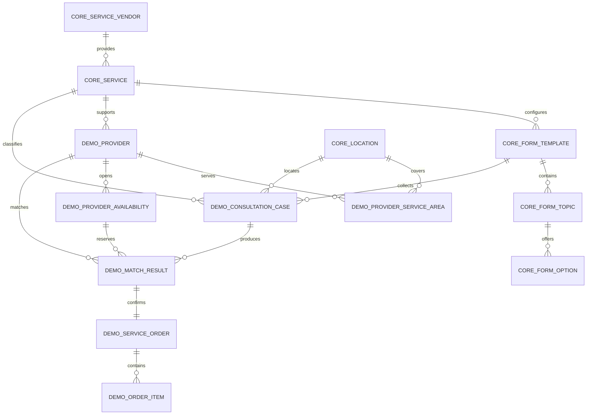

# B+ 資料字典

## 閱讀方式

這份文件描述清洗後 PostgreSQL 的資料用途、關聯與安全邊界。主辦方原始檔
不是資料庫正式 schema，也不會直接載入 Agent 可查詢的區域。

先記住三條規則：

1. `canonical_id` 才是已確認映射；`candidate_canonical_id` 只是調查提示。
2. `source_type=synthetic` 是 Demo 資料，不代表真實師傅、案件或訂單。
3. Agent 只能讀取 `agent` schema，不可直接存取 `core`、`quarantine` 或任意 SQL。

## Schema

| Schema | 用途 | Agent 可否直接存取 |
|---|---|---|
| `core` | 通過 B+ 規則的服務、行政區、表單、映射與品質問題 | 否 |
| `quarantine` | 不明代碼與斷裂資料的安全索引 | 否 |
| `demo` | 明確標示為 synthetic 的完整展示流程 | 否 |
| `agent` | 只呈現 verified 且 agent-eligible 資料的 views | 是，由受控工具查詢 |

## 通用來源欄位

| 欄位 | 意義 |
|---|---|
| `source_type` | `official_raw`、`official_repaired`、`external_reference`、`curated_config` 或 `synthetic` |
| `source_file` | 此紀錄可追溯的來源檔或產生器 |
| `source_record_id` | 來源內的穩定紀錄識別碼 |
| `cleaning_rule` | 建立此版本所使用的清洗或產生規則 |
| `quality_status` | `verified`、`review` 或 `quarantined` |
| `agent_eligible` | 是否允許資料進入 `agent` views |
| `loaded_at` | 寫入 PostgreSQL 的時間，不是原始業務事件時間 |

資料庫 constraint 規定：`agent_eligible=true` 時，`quality_status` 必須是
`verified`。

## 關聯圖

`core.source_mapping`、`core.data_issue` 與 `quarantine.source_record` 是稽核資料，
刻意不以外鍵把 unresolved 來源值偽裝成正式資料。

## Core

### `core.service_vendor`

主辦方服務供應商主檔的清洗版本。

| 主要欄位 | 意義 |
|---|---|
| `service_vendor_id` | 主辦方供應商 ID |
| `name`、`description` | 移除 HTML 與控制字元後的顯示文字 |
| 通用來源欄位 | 本表主要為 `official_repaired` |

目前主檔有 6 筆供應商；不存在的 `service_vendor_id=15` 不會補進本表。

### `core.service`

主辦方正式服務主檔。`service_id=17` 是水電修繕 MVP 的正式服務錨點。

| 主要欄位 | 意義 |
|---|---|
| `service_id` | 主辦方服務 ID |
| `service_vendor_id` | 對應 `core.service_vendor` |
| `service_type`、`service_type_name` | 主辦方類型代碼與解析後名稱 |
| `name`、`description`、`image_url` | 正式服務內容 |
| `aliases` | 團隊整理的搜尋別名 |
| `aliases_source_type` | 固定為 `curated_config` |
| `search_text` | 名稱、描述與別名組成的受控搜尋文字 |
| `search_text_source_types` | 搜尋文字使用到的來源類型 |

`service_id=7` 只有語意候選 17，不能當作 17；`service_id=18` 沒有足夠證據。

### `core.location`

主辦方 200 筆行政區與國土測繪中心參考快照整合後的 368 筆行政區。

| 主要欄位 | 意義 |
|---|---|
| `location_id` | `ORG-` 或 `NLSC-` 前綴的資料庫穩定鍵 |
| `county_name`、`district_name` | 正規化名稱，統一使用「台」 |
| `full_name` | 縣市加行政區，例如 `台北市大安區` |
| `postal_code` | 主辦方提供時保留，外部補齊資料可能為 `NULL` |
| `organizer_*` | 主辦方縣市與行政區代碼 |
| `nlsc_*` | 國土測繪中心行政區代碼 |

### `core.source_mapping`

保存來源代碼到正式代碼的確認狀態。

| 主要欄位 | 意義 |
|---|---|
| `entity_type` | `service`、`service_vendor` 或 `order_type` |
| `source_system`、`source_id` | 來源系統與原始值 |
| `canonical_id` | 已確認的正式 ID |
| `candidate_canonical_id` | 僅供調查，不得當正式 ID 使用 |
| `mapping_status` | `verified`、`unresolved` 或 `rejected` |
| `mapping_method` | 判斷方法 |
| `evidence` | 結構化證據或限制說明 |

目前 unresolved：

| 類型 | 來源 ID | 候選 | 原因 |
|---|---|---|---|
| service | 7 | 17 | 內容像水電問題，但沒有主檔證據 |
| service | 18 | 無 | 主檔不存在 |
| service_vendor | 15 | 無 | 主檔不存在 |
| order_type | 07 | 無 | schema 未定義 |

### `core.data_issue`

保存每項資料問題，不保存原始個資 payload。

| 主要欄位 | 意義 |
|---|---|
| `issue_id` | 單次固定資料版本中的問題 ID |
| `source_table`、`source_record_id` | 問題來源 |
| `issue_code` | 可供統計與測試使用的穩定代碼 |
| `severity` | `info`、`warning` 或 `error` |
| `message`、`details` | 人類說明與結構化細節 |

### 表單表

| 資料表 | 用途 | 主鍵 |
|---|---|---|
| `core.form_template` | 版本化的水電諮詢表單 | `form_key` |
| `core.form_topic` | 題目、題型、必填與排序 | `form_key + topic_key` |
| `core.form_option` | 題目的穩定選項值與標籤 | `option_key` |

這三張表的來源是 `curated_config`，不是主辦方已損壞的諮詢範例。

## Quarantine

### `quarantine.source_record`

只保存問題索引：

| 欄位 | 意義 |
|---|---|
| `source_table`、`source_record_id` | 原始紀錄位置 |
| `issue_codes` | 隔離原因 |
| `raw_preserved_in` | 原始資料仍位於哪個本機檔案 |
| `raw_payload_included` | constraint 固定為 `false` |

此表不會複製含明文聯絡資料的 `feedback_content`。

## Demo

以下資料全部必須是 `source_type=synthetic`，ID 使用 `SYN-` 前綴。

| 資料表 | 用途 | 重要關聯 |
|---|---|---|
| `demo.provider` | 模擬水電師傅 | `service_id -> core.service` |
| `demo.provider_service_area` | 師傅可服務區域 | provider + location |
| `demo.provider_availability` | 師傅可用時段 | provider |
| `demo.consultation_case` | 結構化諮詢案件 | service + form + location |
| `demo.match_result` | 案件媒合結果與原因 | case + provider + slot |
| `demo.service_order` | 使用者確認後的 Demo 訂單 | case + match + provider |
| `demo.order_item` | Demo 訂單明細 | order |

這條 synthetic 鏈是為了展示產品閉環，不能用來宣稱真實市場規模、師傅供給、
媒合準確率或歷史營運成果。

## Workflow

`workflow` 保存消費者確認後的執行中業務狀態，不是 Agent 可任意查詢的知識庫。
目前所有資料仍固定為 `source_type=synthetic`。

| 資料表 | 用途 | 重要限制 |
|---|---|---|
| `workflow.service_case` | 通用派單案件與服務／表單／地點／廠商快照 | 同 session 最多一筆 active case |
| `workflow.service_order` | 廠商接受後建立的訂單 | `case_id` unique，一案一單 |
| `workflow.case_audit_event` | 派單、接受、拒絕與聯絡資料揭露 | `sequence_no` 保序，event／actor type 白名單 |
| `workflow.idempotency_record` | 防止重複寫入並保存原案件結果 | key unique、SHA-256 fingerprint |

`workflow.service_case` 不對 `core`／`demo` 設硬外鍵，因為 Web 可使用不同的
已驗證 Read Repository；它會保存建立當下的識別碼與顯示文字快照。候選是否
有效仍由 `WebSessionService` 與 `CaseWorkflowService` 在確認派單前驗證。

完整 transaction、locking、設定與測試見
[`postgres-case-persistence.md`](postgres-case-persistence.md)。

## Agent Views

| View | Agent 用途 |
|---|---|
| `agent.service_catalog` | 搜尋正式服務與供應商 |
| `agent.location_catalog` | 解析與查詢行政區 |
| `agent.form_template` | 取得啟用中的表單 |
| `agent.form_topic` | 找出需要追問的欄位 |
| `agent.form_option` | 驗證選項值 |
| `agent.available_provider_slot` | 查詢 synthetic 可服務師傅與時段 |
| `agent.consultation_case` | 查詢 synthetic 案件 |
| `agent.service_order` | 查詢 synthetic 訂單狀態 |

歷史 99 筆訂單不會進入任何 `agent` view。

## 查詢邊界

- Service Layer 使用固定參數化查詢，不接受模型產生任意 SQL。
- Agent 工具的資料庫帳號只授予所需 `agent` views 權限。
- 建立案件或訂單前，仍需由 Service Layer 驗證服務、行政區、時段與狀態轉換。
- 模型與唯讀 MCP Tools 不得直接存取 `workflow` schema。
- `candidate_canonical_id`、`review`、`quarantined` 與歷史範例不得進入建立流程。
