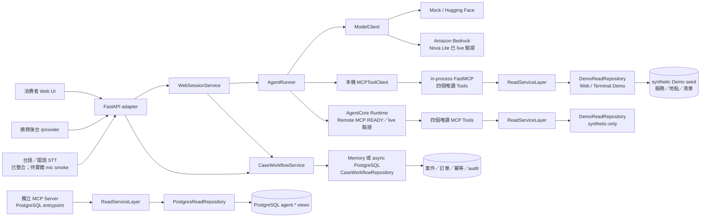
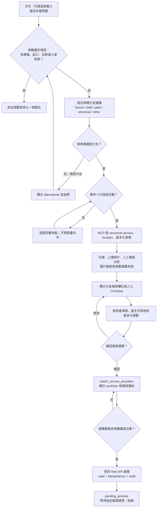
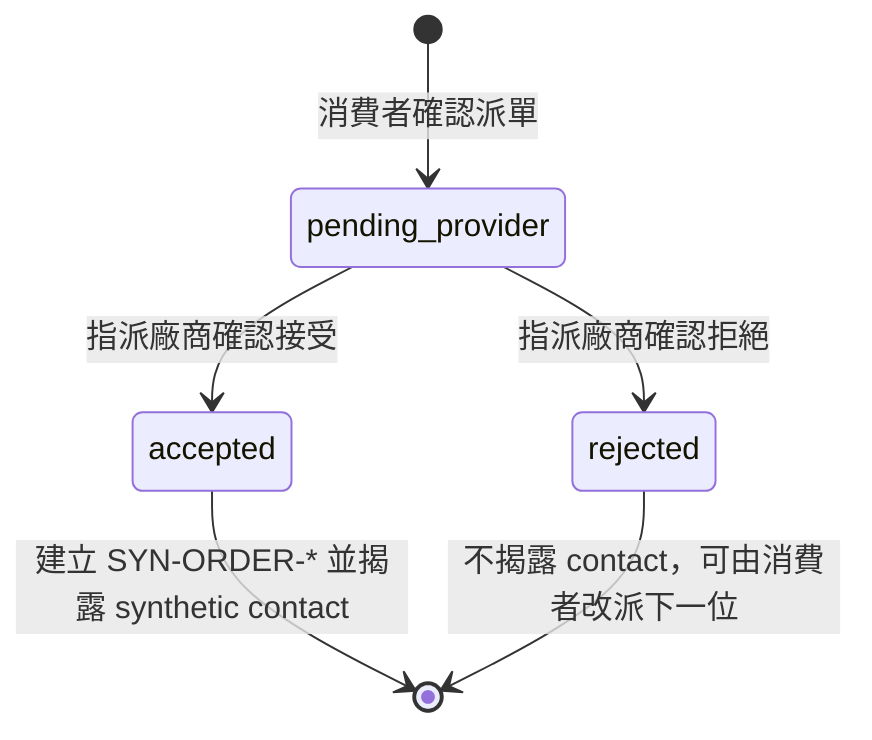
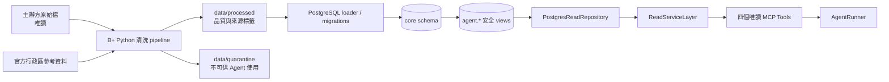

# 專案白話指南

最後更新：2026-08-03

這份文件回答五個問題：我們做了什麼、AI 用在哪裡、資料庫怎麼被查詢、廠商如何
接案，以及想修改某個功能時應先看哪裡。實際完成狀態以
[實作索引](implementation-index.md)為準，未完成工作以
[TASKS](../TASKS.md)為準。

## 30 秒理解

「修繕小隊長｜Repair Captain AI」是一套居家水電修繕 AI 生活管家：

1. 消費者用自然語言描述需求。
2. 模型決定要查哪個唯讀工具，但不能直接碰資料庫。
3. MCP Tool 經 Service Layer 查出服務、行政區與彈性諮詢單。
4. 消費者自己填表、核對 Checklist，並選擇 synthetic 服務商。
5. 只有消費者明確確認後，系統才建立案件。
6. 指派廠商在後台接受或拒絕；接案後才揭露完整 synthetic 聯絡資料並建立
   `SYN-ORDER-*` Demo 訂單。

目前本機雙端流程已能執行，案件 repository 可選記憶體或 PostgreSQL。比賽期間曾以
Amazon Nova Lite、`BedrockModelClient` 與 AgentCore Remote MCP 完成 Browser 四工具
閉環，程式與遮罩 evidence 已保留。但這不等於目前仍有可用的 AWS endpoint 或公開
網站；正式登入、真實個資、真實廠商、RDS 與公開 Web hosting 都不在目前成果內。

## 競賽定位與展示亮點

我們不是只做一個「輸入關鍵字就列出師傅」的搜尋框，而是把水電報修拆成一條可驗證、
可人工掌控的智慧管家流程：

1. 引導式多輪對話：資訊不足時追問地點與修繕細節，不偷偷猜縣市、服務或表單答案。
2. 五種修繕分支：水龍頭、馬桶、水管、電氣與其他問題共用單一 Active Task，切換分支
   前需要確認。
3. 人工決策邊界：AI 可以整理需求、查表單與推薦候選；Checklist、摘要確認與派單仍由
   使用者操作。
4. AWS 工具閉環：Bedrock 負責理解與選工具，AgentCore Runtime 暴露四個唯讀 MCP
   Tools，Service Layer 驗證 canonical ID 與媒合規則。
5. 高齡友善入口：台語／國語語音辨識已整合至 Web，輸出繁中供使用者修改後送出；
   實體麥克風 smoke 仍在進行，且不宣稱台語 TTS 已完成。
6. 資料可信度：主辦方原始資料、人工設定與 synthetic Demo 資料都有來源標籤，展示
   時不把模擬資料說成真實營運資料。

## 每一層負責什麼

| 名稱 | 白話說法 | 本專案責任 |
|---|---|---|
| Web UI | 消費者與廠商看到的畫面 | 顯示對話、表單、候選、案件與接案控制 |
| FastAPI | 網頁後端入口 | 接收 HTTP 請求、驗證格式、呼叫共用服務；不寫 SQL |
| AgentRunner | 對話流程控制器 | 把訊息、工具規格與結果交給模型，控制最多呼叫次數與工具白名單 |
| ModelClient | 語言理解 | 可選 Mock、Hugging Face 或 Amazon Bedrock；缺設定時 fail fast，不靜默換模型 |
| MCP | Agent 的標準工具協定 | 讓模型只能呼叫名稱與參數明確的工具，不接受任意 SQL |
| Service Layer | 商業規則唯一來源 | 查詢、媒合、確認、冪等、權限、稽核與合法狀態轉換 |
| Repository | 資料存取 adapter | 把 Service 的固定操作轉成 SQL 或記憶體操作 |
| PostgreSQL | 保存可驗證事實 | 保存清洗後目錄，以及可選的案件、訂單、冪等與 audit |

關鍵原則：

> 模型理解與選工具；Service Layer 決定能不能做；Repository 存取資料；
> PostgreSQL 保存事實。

## 目前架構

實線是已驗證的元件或路徑。AgentCore 的 live 驗證目前使用 synthetic 資料，並不代表
Web、資料庫與所有周邊服務都已上雲。

完整的 AWS 角色與未來部署方式見[系統與 AWS 架構](architecture.md)。

## 消費者流程

聊天查詢與按鈕寫入是兩條不同路徑。模型可以查資料和追問，但不能代替使用者
確認修繕分支、勾選 Checklist、確認最新摘要或派單。每個 session 只維護一項
Active Task；如果使用者改談另一種問題，系統先詢問是否取代，不會偷偷混合兩份表單。

語音輸入只改變「如何把需求填進文字框」，不會繞過後面的分支確認、表單、摘要與
派單確認。照片也只是受控建議：必須綁定目前修繕分支，未確認的模型結果不能進入案件。

## 廠商接案流程

目前只有被指派的 synthetic 廠商能讀到案件。列表永遠只顯示遮罩聯絡資料；
完整 synthetic contact 只在接受案件後的詳情中出現。

確認、冪等、指派隔離、audit 及狀態轉換契約見
[派單／接單說明](provider-workflow.md)。

## 資料如何走到 Agent

原始資料永遠不被覆寫。清洗程式只把能確認的資料放進正式目錄；斷裂關聯與
不明代碼留在 quarantine。為了讓 Demo 閉環可執行，人工設定與 synthetic
資料都有明確來源標籤。

`PostgresReadRepository` 已通過 PostgreSQL 整合測試，獨立 MCP Server 的
entrypoint 預設組裝這個 repository；外部 HTTP Client 尚未端到端驗證。目前
Web app 與 Terminal Demo 建立的 in-process MCP Server 則使用
`DemoReadRepository`。不要因為案件可切到 PostgreSQL，就誤以為 Web 的服務
目錄、地區、表單與媒合也已經自動改查資料庫。

常見來源標籤：

- `official_repaired`：主辦方資料經可追蹤規則修復格式。
- `curated_config`：團隊明確定義的表單、別名或政策設定。
- `synthetic`：只供開發、測試與展示的模擬廠商、時段、案件或聯絡資料。

任何 synthetic 資料都不能宣稱為主辦方真實營運資料。

## 想改功能時先看哪裡

| 想處理的事情 | 先讀 | 主要程式 |
|---|---|---|
| 看目前做到哪裡 | [HANDOFF](../HANDOFF.md)、[實作索引](implementation-index.md)、[TASKS](../TASKS.md) | 不應先猜程式 |
| 改消費者或廠商網頁 | [Web README](../src/home_repair_agent/web/README.md) | `web/app.py`、`web/service.py`、`web/static/` |
| 改模型或多輪 Tool loop | [Agent README](../src/home_repair_agent/agent/README.md) | `agent/loop.py`、`agent/huggingface_model.py` |
| 新增或修改 MCP Tool | [MCP README](../src/home_repair_agent/mcp_server/README.md) | `mcp_server/server.py`、`mcp_server/models.py` |
| 改服務搜尋、地點、表單或媒合 | [Service Layer](service-layer.md) | `backend/services.py`、`backend/postgres_repository.py` |
| 改派單、接單、冪等或 audit | [派單／接單說明](provider-workflow.md) | `backend/case_services.py`、兩種 case repository |
| 改 schema 或資料清洗 | [資料政策](data-policy.md)、[資料字典](data-dictionary.md) | `data_cleaning/`、`sql/migrations/` |
| 檢查行為是否被破壞 | [測試 README](../tests/README.md) | `tests/` |

## 最容易混淆的邊界

- FastAPI 是後端入口，不是前端畫面，也不是 Agent Tool。
- MCP Tool 不是 SQL；它只能呼叫範圍明確的 Service。
- Web session、對話與 Checklist 仍在記憶體；它們不會因案件 repository 使用
  PostgreSQL 就自動持久化。
- Web 與 Terminal Demo 的服務、地區、表單與媒合目前使用
  `DemoReadRepository`；獨立 MCP Server 與 PostgreSQL 整合測試使用
  `PostgresReadRepository`，兩者共用同一份 `ReadServiceLayer` 契約。
- 案件、訂單、冪等與 audit 可切換到 async PostgreSQL repository。
- 四個 MCP Tools 全部唯讀；派單與接案目前由 Web 按鈕直接呼叫
  `CaseWorkflowService`。
- Hugging Face 與 Bedrock 都有 model adapter；Bedrock Nova Lite 已透過 Web remote
  ToolClient 完成 AgentCore live 閉環；RDS 與公開 Web hosting 未完成。
- 台語／國語 STT 已整合辨識與回填輸入框；實體麥克風 smoke 仍待完成，台語 TTS 仍只有
  feasibility spike，不能在 Demo 中宣稱雙向台語語音已完成。
- Demo contact 是 synthetic。正式個資加密、同意、保存及刪除政策仍是待辦。

## 目前已完成與尚未完成

已完成並已納入目前基線：

- B+ 資料清洗、來源標籤、品質報告及 PostgreSQL loader。
- 服務／地點／表單／媒合 Service 與四個唯讀 MCP Tools。
- Mock、Hugging Face 與 Bedrock ModelClient 契約、Agent tool loop。
- Bedrock Nova Lite 經既有 AgentRunner 與 MCP／Service Layer 的四工具 live 閉環。
- 消費者人工 Checklist、動態表單、媒合、明確確認派單。
- 廠商案件列表、遮罩 contact、接受／拒絕與消費者狀態更新。
- memory／async PostgreSQL 案件 repository、冪等、audit 與並行狀態保護。
- 桌機／手機響應式與無障礙基線。

也已納入目前作品集基線：

- AgentCore Runtime Remote MCP 的 `initialize`、`tools/list`、四工具與 Browser live，
  包含 service／location ID provenance 驗證。
- 台語／國語 STT 的錄音、Breeze ASR 與繁中輸入框回填程式。

尚未完成：

- 固定 Hugging Face eval 矩陣。
- Web 讀取 repository 的 Demo／PostgreSQL 可設定切換。
- 可重現的公開 HTTPS 部署；repo 目前只保證本機 Mock Demo。
- 台語／國語 STT 的完整實體麥克風品質矩陣；台語 TTS 尚未產品化。
- 正式登入、時段保留、真實個資政策、回覆紀錄與通知。
- RDS、正式 Web hosting、正式 authentication／RBAC 與 production 維運。

完整優先順序與驗收條件請直接看 [TASKS](../TASKS.md)。
