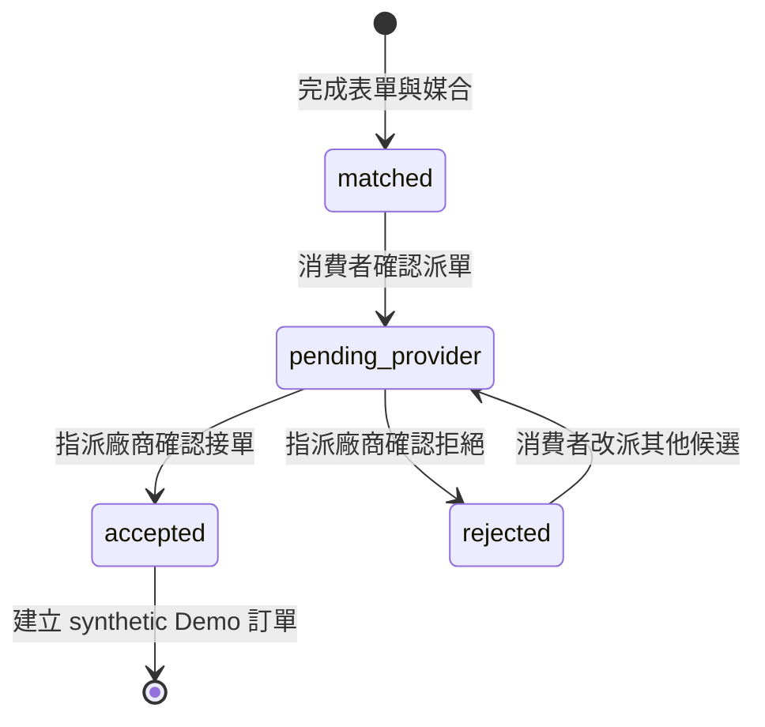

# 服務廠商派單／接單 P0

最後更新：2026-07-31

## 1. 做了什麼

本階段完成一條可在本機操作的雙端流程：

1. 消費者完成需求、表單與 synthetic 師傅媒合。
2. 消費者選擇一位廠商，看到資料使用說明後明確確認派單。
3. 系統建立 `pending_provider` Demo 案件。
4. 只有被指派的 Demo 廠商能在 `/provider` 看到案件。
5. 廠商接單前只看到遮罩聯絡資料。
6. 廠商再次確認接受或拒絕。
7. 接受時建立 synthetic Demo 訂單並揭露完整 synthetic 聯絡資料；拒絕時不揭露。
8. 消費者頁輪詢案件狀態，顯示接單結果與 Demo 訂單編號。
9. 若案件含已確認測試圖片，指派廠商可在 pending／accepted 查看；rejected 後撤銷。

新增的核心模組：

- `backend/case_models.py`：案件、命令、檢視模型、狀態與稽核事件。
- `backend/case_ports.py`：寫入 repository 介面。
- `backend/case_services.py`：確認、冪等、授權、狀態轉換與稽核規則。
- `web/demo_case_repository.py`：process-local P0 repository。
- `backend/postgres_case_repository.py`：可選的 PostgreSQL transaction repository。
- `sql/migrations/002_case_workflow.sql`：案件、訂單、冪等與 audit schema。
- `web/app.py`：消費者派單與廠商案件 HTTP API。
- `web/static/provider.*`：廠商工作台。
- `backend/media_storage.py`、`sql/migrations/003_case_media_contract.sql`：私有圖片
  檔案與案件相對路徑／結構化分析持久化。

刻意沒做：

- Web 對話 session 仍是 process-local；PostgreSQL 模式只恢復案件業務狀態。
- 尚未建立或連接 AWS RDS。
- 沒有建立寫入 MCP Tool；目前四個 MCP Tools 仍全部唯讀。
- 沒有正式登入、JWT、Cognito、RBAC、廠商帳號或多租戶隔離。
- 沒有真的保留師傅時段、付款、通知或正式個資；圖片 Demo 只接受
  synthetic／公開測試素材。
- 沒有宣稱 synthetic 廠商、聯絡資料、案件或訂單是真實資料。

## 2. 五項產品與安全規則

團隊同意以下規則，程式與測試都以此為準：

1. **消費者明確確認後才派單**：只看候選不會建立案件。
2. **只有被指派廠商能看案件**：其他 Demo 廠商的列表為空，直接查詢也回 404。
3. **待回覆時聯絡資料遮罩**：顯示 `林○安`、`0912***678` 與行政區，不顯示詳細地址。
4. **接單後才揭露，拒絕永不揭露**：接受會建立 Demo 訂單並寫入揭露 audit；拒絕後可改派其他未拒絕候選。
5. **寫入具確認、冪等、稽核與原子狀態轉換**：重複請求不建立第二案；相同 key 不得搭配不同 payload；並行接受／拒絕只能有一個成功。
6. **圖片權限跟隨案件指派與狀態**：未指派與 rejected 回 404；pending／accepted
   才能透過受控 endpoint 讀取，Browser 永遠不取得內部 `image_path`。

## 3. 狀態機



終止狀態不能被覆寫。若接受與拒絕同時送達，`CaseWorkflowService` 的原子區段只
允許第一個合法轉換成功，另一個回傳 conflict。

## 4. 完整資料流

### 消費者派單

```text
POST /api/sessions/{session_id}/dispatch
  -> FastAPI 驗證 DispatchRequest
  -> WebSessionService 確認 session 已完成媒合、候選存在
  -> CaseWorkflowService 驗證 confirmed 與 idempotency key
  -> memory 或 PostgreSQL CaseWorkflowRepository
  -> 同一 transaction 建立 pending_provider 案件、audit 與 idempotency
  -> ConsumerCaseView
  -> 消費者頁開始輪詢 session
```

### 廠商查看與決策

```text
X-Demo-Provider-Id
  -> GET /api/provider/cases
  -> CaseWorkflowService 只列出 assigned_provider_id 相符案件
  -> 列表永遠只回遮罩 contact

GET /api/provider/cases/{case_id}
  -> pending_provider: masked contact
  -> accepted: full synthetic contact
  -> rejected: unavailable contact

POST /api/provider/cases/{case_id}/decision
  -> ProviderDecisionRequest(accept | reject, confirmed, idempotency_key)
  -> CaseWorkflowService 驗證指派廠商、狀態與冪等
  -> accept: accepted + SYN-ORDER-* + contact_revealed audit
  -> reject: rejected，不建立訂單、不揭露 contact

GET /api/provider/cases/{case_id}/image + X-Demo-Provider-Id
  -> CaseWorkflowService 先驗證 assigned provider
  -> pending / accepted: LocalMediaStorage 讀取並以 no-store 回應
  -> rejected / unassigned / missing: 404
```

### 消費者取得結果

```text
GET /api/sessions/{session_id}
  -> WebSessionService 讀取最新 ConsumerCaseView
  -> pending / accepted / rejected 映射回 SessionView
  -> 前端每 3 秒輪詢直到終止狀態
```

## 5. HTTP 契約

| Method | Path | 用途 |
|---|---|---|
| `POST` | `/api/sessions/{id}/dispatch` | 消費者確認派給指定候選 |
| `GET` | `/api/provider/identities` | 取得兩個 synthetic Demo 廠商身分 |
| `GET` | `/api/provider/cases` | 列出目前 Demo 廠商被指派的案件 |
| `GET` | `/api/provider/cases/{case_id}` | 取得依狀態分級的案件詳情 |
| `GET` | `/api/provider/cases/{case_id}/image` | 指派且非 rejected 廠商查看圖片 |
| `POST` | `/api/provider/cases/{case_id}/decision` | 指派廠商接受或拒絕 |

`X-Demo-Provider-Id` 只用於 Demo 身分切換。它讓權限規則可被操作與測試，但任何人
都能改 header，因此**不能視為正式驗證機制**。

## 6. 邊界與資料政策

- 消費者聯絡人、手機、地址、廠商、案件與訂單全部為 `source_type=synthetic`。
- 前端會顯示 `DEMO · SYNTHETIC`，API 模型也保留來源欄位。
- 自由文字前會警告不得輸入真實個資；P0 不宣稱能自動辨識所有電話、地址或姓名。
- 列表只回遮罩資料；完整資料只在指派廠商已接受後的詳情 API 回傳。
- 未授權廠商一律收到 404，不藉由 403 暴露案件是否存在。
- FastAPI route 只做 adapter；狀態規則在 `CaseWorkflowService`。
- `WEB_CASE_REPOSITORY=memory|postgres` 以 dependency injection 切換；SQL
  只在 PostgreSQL repository，不放進 Service 或 route。
- PostgreSQL 模式保存 synthetic contact；pending 仍只能取得遮罩 view。
- Agent 目前不能呼叫這些寫入 API；四個 MCP Tools 保持唯讀。
- API response 使用 `Cache-Control: no-store`；前端以 `textContent` 呈現資料。
- 案件資料庫只存 server-relative `image_path` 與已確認結構化分析；圖片 bytes 不進
  PostgreSQL、audit 或 log。API 以 `has_image` 取代 path 揭露。

## 7. 驗證

聚焦測試：

```powershell
python -m pytest -q `
  tests/test_case_workflow.py `
  tests/test_web_app.py `
  tests/test_postgres_case_repository.py
```

涵蓋：

- 未確認不能建案。
- 派單與廠商決策冪等。
- 相同 idempotency key 搭配不同 payload 會被拒絕。
- 未指派廠商看不到列表或詳情。
- pending 遮罩、accepted 揭露、rejected 不揭露。
- 接單建立 synthetic Demo 訂單與完整 audit。
- 拒絕後只能改派其他候選。
- 並行接受／拒絕只有一個成功。
- 已有 audit 的 session 不能以 reset 擦除。
- 表單完成後時段才過期時，派單仍會被拒絕。
- Service Layer 會重驗 `+08:00`、時間順序與 12 小時上限。
- App factory 不允許消費者與 provider API 使用不同 workflow。
- filter 排除目前案件時，右側詳情與決策按鈕同步清除或切換。
- 圖片 endpoint 對未指派／rejected 回 404，pending／accepted 可讀，且 response
  為正確 MIME、`Content-Disposition: inline`、`Cache-Control: no-store`。

2026-07-30 無資料庫聚焦結果：`33 passed, 6 skipped, 3 subtests passed`；
真實 PostgreSQL 新舊 integration 合跑 `15 passed`，完整 suite（提供測試資料庫）
`113 passed, 43 subtests passed`。PostgreSQL 案件路徑已全面 async，並由可手動
重跑的 GitHub Actions PostgreSQL CI 驗證。瀏覽器另外完成消費者派單、廠商
接單、聯絡資料解鎖、消費者狀態回寫與未指派廠商隔離；桌機 `1280x720`、
手機 `390x844` 無水平 overflow 或 console error。本輪另驗證 filter 切換不會
保留被排除案件的詳情與操作按鈕。

2026-07-31 圖片契約新增後，本機完整 suite 為
`134 passed, 18 skipped, 52 subtests passed`；provider image tests 覆蓋 pending、
accepted、rejected、未指派、path 不外洩及 response headers。PostgreSQL migration
003 的 live integration 因未設 `TEST_DATABASE_URL` 待 CI 複驗。

## 8. 下一階段

上 AWS 前仍需依序完成：

1. 將 Web session／Agent 記憶另行持久化並提供同意與刪除機制。
2. 將 `X-Demo-Provider-Id` 換成正式登入身分與角色授權。
3. 加入時段保留與同一師傅排程衝突控制。
4. 需要 Agent 或 LumineOne 寫入時，再設計少量受限 MCP Tools；不可直接公開通用 SQL。
5. 最後才接 RDS、Bedrock／AgentCore、通知與公開部署。
